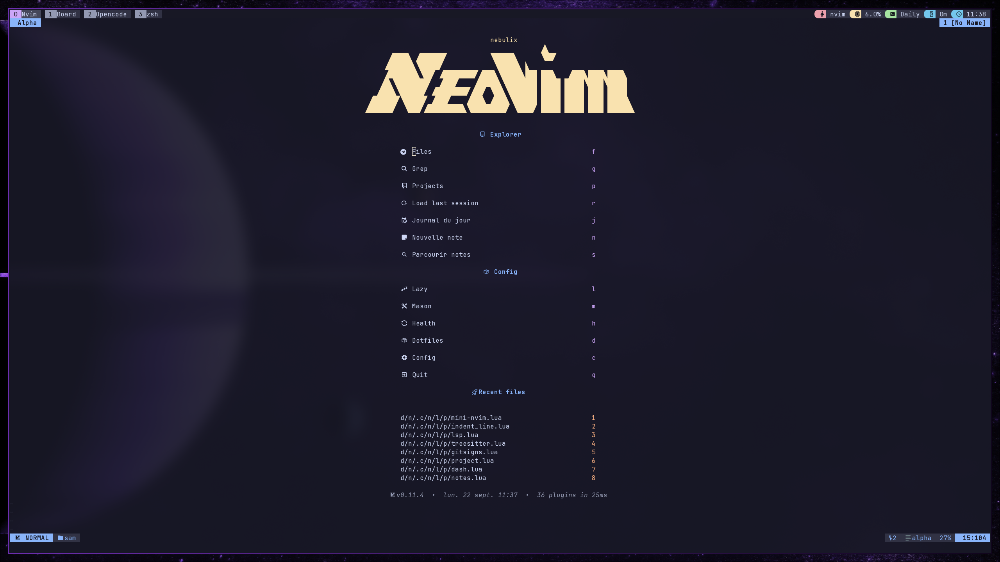
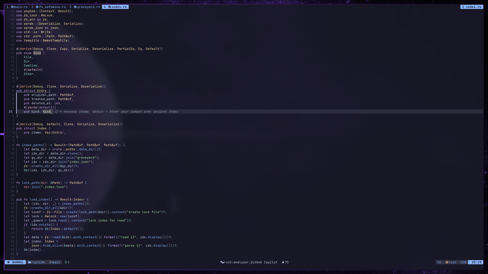
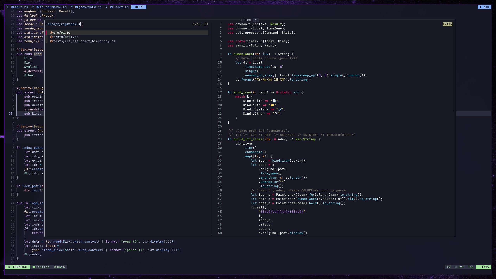
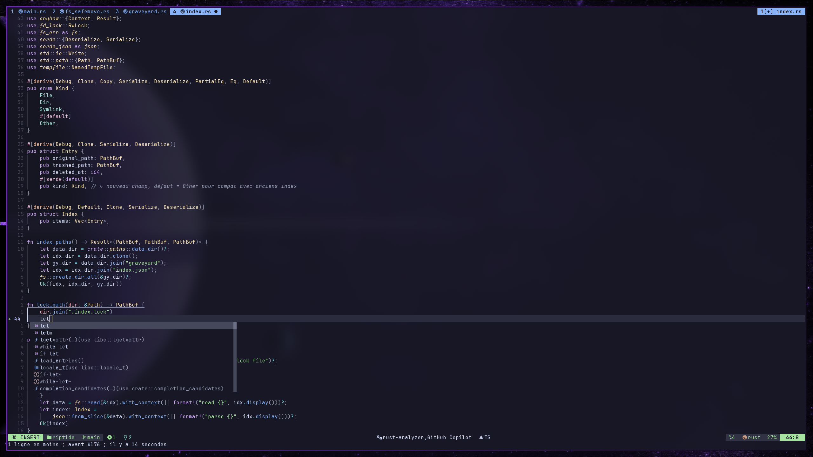
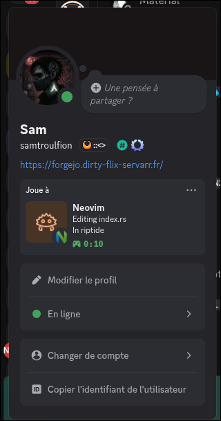
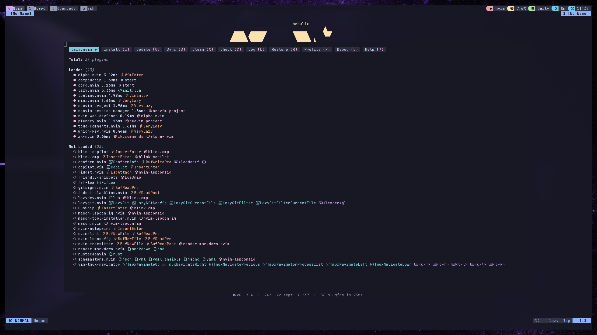
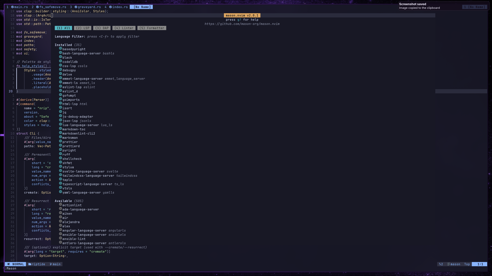

# NebuVim

> **A modern, complete, not bloated and personalized Neovim configuration**

<div align="center">


*Based on [kickstart.nvim](https://github.com/nvim-lua/kickstart.nvim) and extended for an optimal development experience*


</div>

> [!WARNING]
> NebuVim is intentionally lightweight in user friendly plugins compared to feature-heavy distributions (no 100+ plugins here). It requires basic Vim/Neovim knowledge to be effective.
>
> **Before diving in:**
> - Run `vimtutor` to learn Vim basics
> - Use `:h <topic>` for built-in help, or `<leader>sh` (our FZF-lua shortcut) to search help topics
> - This config assumes you understand Vim modes, navigation, and core concepts
>
> If you want a more guided experience, consider LazyVim or AstroNvim. If you want lean performance with essential tools, you're in the right place.

## What Makes NebuVim Different

> **Minimal, stable, and functional - not a bloated distribution**

NebuVim is built upon the excellent kickstart.nvim foundation but includes several key improvements and opinionated choices for modern development (because vanilla kickstart is great, but it is design to be improved):

### Key Changes from Kickstart

- **FZF-lua over Telescope**: Switched to fzf-lua for significantly faster fuzzy finding and better performance
- **Blink.cmp over nvim-cmp**: Modern autocompletion engine that's faster and more responsive
- **Catppuccin Theme**: Beautiful, consistent theming with transparency support
- **Enhanced Lualine**: Custom statusline with advanced indicators (LSP status, Git, diagnostics, macro recording)
- **Modern Web Stack**: Optimized for JavaScript/TypeScript, Svelte, and Tailwind CSS development
- **Rust Integration**: First-class Rust support with rustaceanvim
- **Additional Productivity Tools**: Discord RPC, note-taking with Zk, project management

## Features

### Interface & Theme



*Catppuccin Mocha - because your eyes deserve better than harsh white backgrounds*

- **[Catppuccin Mocha](https://github.com/catppuccin/nvim)** theme with transparency support
- **Custom [Lualine](https://github.com/nvim-lualine/lualine.nvim)** with advanced indicators (LSP, Git, diagnostics, macro recording)
- **[Which-key](https://github.com/folke/which-key.nvim)** for contextual keybinding help (no more memorizing 200+ keybinds)
- **Nerd Font icons** for a modern interface

### Navigation & Search



*FZF-lua doing what it does best - finding your files faster than you can type "telescope"*

- **[FZF-lua](https://github.com/ibhagwan/fzf-lua)** for blazing-fast fuzzy finding (replaces Telescope - sorry Telescope fans, but speed wins)
- **Treesitter** for advanced syntax highlighting
- **[Gitsigns](https://github.com/lewis6991/gitsigns.nvim)** for visual Git integration
- **[Project](https://github.com/coffebar/neovim-project) management** for quick project switching

### Development Stack

#### Modern Web Development
- **TypeScript/JavaScript** with ts_ls and comprehensive formatting
- **Svelte** with dedicated language server and syntax support
- **Tailwind CSS** with intelligent autocompletion and class suggestions
- **ESLint & Prettier** integration with prettierd for fast formatting

#### Systems Programming
- **Lua** development with full LSP support and lazydev for Neovim API
- **Rust** with rustaceanvim for advanced tooling (cargo integration, inlay hints, debugging)

#### Core Development Tools



*Blink.cmp autocompletion - faster than your thoughts, more accurate than your typing*

- **Complete LSP setup** with Mason for automatic tool installation
- **[Blink.cmp](https://github.com/Saghen/blink.cmp)** for fast, modern autocompletion (nvim-cmp who?)
- **nvim-lint** for asynchronous linting
- **GitHub Copilot** integration (because sometimes we all need an AI pair programmer)

### Productivity



*Let your Discord friends know you're serious about your editor choice*

- **Smart autopairs** with context awareness
- **Intelligent commenting** with Comment.nvim
- **Mini.nvim** suite for various utilities (because who doesn't love a good Swiss Army knife?)
- **Zk notes** for Zettelkasten-style note-taking
- **Discord Rich Presence** with cord.nvim (flex those editing skills)
- **Dash documentation** (macOS)

## Installation

### Prerequisites

```bash
# Essential tools
sudo apt install git make gcc unzip ripgrep fd-find xclip

# Neovim (stable or nightly)
sudo add-apt-repository ppa:neovim-ppa/unstable -y
sudo apt update && sudo apt install neovim

# Nerd Font (recommended)
# Install a Nerd Font from https://www.nerdfonts.com/

# For web development
npm install -g typescript svelte-language-server @tailwindcss/language-server
npm install -g prettier eslint_d prettierd

# For Rust development
curl --proto '=https' --tlsv1.2 -sSf https://sh.rustup.rs | sh
```

### Install NebuVim

```bash
# Backup existing config (trust me, you'll want this)
mv ~/.config/nvim ~/.config/nvim.backup

# Clone NebuVim
git clone https://github.com/your-username/nebu-nvim.git ~/.config/nvim

# Launch Neovim (grab a coffee, first startup takes a moment)
nvim
```


*Lazy.nvim doing its magic on first launch*

## Key Bindings

### Navigation
| Keybinding | Action |
|------------|--------|
| `<Space>` | Leader key |
| `<C-h/j/k/l>` | Navigate between windows |
| `<M-h/l>` | Previous/next buffer |
| `<Esc>` | Clear search highlights |

### FZF Search


| Keybinding | Action |
|------------|--------|
| `<leader>sf` | Find files (the holy grail of navigation) |
| `<leader>sg` | Live grep (search through everything) |
| `<leader>sb` | Find buffers |
| `<leader>sh` | Search help |
| `<leader>sk` | Search keymaps |
| `<leader>sr` | Resume last search |

### LSP & Code


| Keybinding | Action |
|------------|--------|
| `gd` | Go to definition (teleport to where it's defined) |
| `gr` | Find references (who's using this thing?) |
| `K` | Hover documentation |
| `<leader>rn` | Rename symbol (refactor like a boss) |
| `<leader>ca` | Code actions |
| `<leader>f` | Format buffer |

### Buffers
| Keybinding | Action |
|------------|--------|
| `<leader>bd` | Delete buffer |
| `<leader>bo` | Delete other buffers |
| `<leader>bn/bp` | Next/previous buffer |

### Git
| Keybinding | Action |
|------------|--------|
| `<leader>gp` | Preview hunk |
| `<leader>gb` | Blame line |
| `<leader>td` | Toggle deleted lines |

## Project Structure

```
~/.config/nvim/
├── init.lua                 # Main entry point
├── lua/
│   ├── options/            # Core configuration
│   │   ├── options.lua     # Neovim options
│   │   ├── nvim-keymaps.lua # Basic keymaps
│   │   └── autocmd.lua     # Autocommands
│   ├── plugins/            # Plugin configurations
│   │   ├── lsp.lua         # LSP configuration
│   │   ├── fzf-lua.lua     # Fuzzy finder
│   │   ├── lualine.lua     # Status line
│   │   ├── treesitter.lua  # Syntax highlighting
│   │   ├── rust.lua        # Rust development
│   │   └── ...             # Other plugins
│   └── config/             # Additional configurations
├── .stylua.toml            # Lua formatting config
└── README.md               # This file
```

## Included Plugins

<details>
<summary><b>Interface & Navigation</b></summary>

- **catppuccin/nvim** - Modern theme with transparency support
- **nvim-lualine/lualine.nvim** - Highly customizable statusline
- **folke/which-key.nvim** - Contextual keybinding help
- **ibhagwan/fzf-lua** - Ultra-fast fuzzy finder (replaces Telescope)
- **nvim-tree/nvim-web-devicons** - File type icons

</details>

<details>
<summary><b>Development & LSP</b></summary>

- **neovim/nvim-lspconfig** - LSP client configurations
- **mason-org/mason.nvim** - LSP/linter installer
- **saghen/blink.cmp** - Fast, modern autocompletion
- **nvim-treesitter/nvim-treesitter** - Advanced parsing and highlighting
- **mfussenegger/nvim-lint** - Asynchronous linting
- **github/copilot.vim** - AI-powered code completion
- **mrcjkb/rustaceanvim** - Complete Rust development environment

</details>

<details>
<summary><b>Web Development Stack</b></summary>

- **TypeScript/JavaScript**: ts_ls with intelligent features
- **Svelte**: Dedicated language server with component support
- **Tailwind CSS**: Smart class completion and utilities
- **ESLint/Prettier**: Integrated linting and formatting

</details>

<details>
<summary><b>Git & Version Control</b></summary>

- **lewis6991/gitsigns.nvim** - Git integration with visual indicators
- Comprehensive statusline integration

</details>

<details>
<summary><b>Productivity & Utilities</b></summary>

- **windwp/nvim-autopairs** - Smart bracket/quote pairing
- **numToStr/Comment.nvim** - Intelligent commenting
- **echasnovski/mini.nvim** - Collection of useful utilities
- **zk-org/zk-nvim** - Zettelkasten note-taking
- **vyfor/cord.nvim** - Discord Rich Presence

</details>

## Customization

### Language Server Configuration

The LSP setup in `lua/plugins/lsp.lua` includes configurations for:

```lua
-- Web development
servers = {
  ts_ls = {}, -- TypeScript/JavaScript
  svelte = {}, -- Svelte components
  tailwindcss = {}, -- Tailwind CSS classes
  eslint = {}, -- JavaScript/TypeScript linting
}

-- Systems programming
rust_analyzer = {}, -- Rust (via rustaceanvim)
lua_ls = {}, -- Lua development
```

### Adding New Plugins

Create a new file in `lua/plugins/`:

```lua
-- lua/plugins/my-plugin.lua
return {
  'author/plugin-name',
  config = function()
    -- Plugin configuration
  end,
}
```

### Changing Themes

Edit `lua/plugins/coloscheme.lua` to enable themery or switch themes:

```lua
-- Uncomment to use multiple themes with themery
return {
  'zaldih/themery.nvim',
  -- ... configuration
}
```

## Useful Commands

```bash
# Format Lua code (keep it pretty)
stylua --check .

# Update plugins (stay fresh)
:Lazy update

# View plugin status (see what's broken)
:Lazy

# Open Mason to manage LSP servers (your LSP control center)
:Mason

# Open help documentation (RTFM, but make it easy)
:help

# Find files with fzf (the fast way)
<leader>sf
```



*Mason - your one-stop shop for LSP servers, linters, and formatters*

## Development Environments

### Web Development Setup
```bash
# Install Node.js and required language servers
npm install -g typescript svelte-language-server
npm install -g @tailwindcss/language-server
npm install -g prettier eslint_d prettierd
```

### Rust Development Setup

*Rust development with rustaceanvim - because memory safety is not optional*

```bash
# Install Rust toolchain (you know the drill)
curl --proto '=https' --tlsv1.2 -sSf https://sh.rustup.rs | sh

# Add components (the essential trio)
rustup component add rust-analyzer rustfmt clippy
```

### Lua Development

*Lua development with full Neovim API support - meta-programming at its finest*

Neovim's Lua environment is automatically configured with:
- Full LSP support for Neovim API
- Autocompletion for vim functions
- Type checking and diagnostics

## Resources

- [Neovim Documentation](https://neovim.io/doc/)
- [Lazy.nvim Guide](https://lazy.folke.io/)
- [LSP Configuration](https://github.com/neovim/nvim-lspconfig)
- [Treesitter Guide](https://github.com/nvim-treesitter/nvim-treesitter)
- [FZF-lua Documentation](https://github.com/ibhagwan/fzf-lua)
- [Blink.cmp Documentation](https://github.com/saghen/blink.cmp)

## Contributing

Contributions are welcome! Feel free to:

1. Fork the project (you know the drill)
2. Create a feature branch (`git checkout -b feature/amazing-feature`)
3. Commit your changes (make them count)
4. Push to the branch
5. Open a Pull Request (and let's make NebuVim even better)

## License

This project is licensed under the MIT License. See the [LICENSE.md](LICENSE.md) file for details.

---

<div align="center">

**Made with ❤️, lots of ☕, and probably too much time tweaking configs**

*If this configuration helps you become a 10x developer (or at least feel like one), don't forget to give it a ⭐!*

</div>
